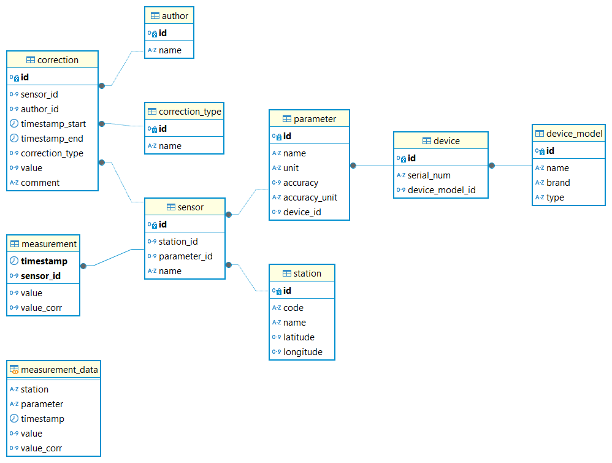

<!-- README.md is generated from README.Rmd. Please edit that file -->

# louroux

<!-- badges: start -->
<!-- badges: end -->

louroux is a data processing application for the Louroux observatory
site (University of Tours and Zone Atelier Loire site).

## Installation

### Install package from GitHub

``` r
remotes::install_github("https://github.com/LouisManiere/louroux.git")
```

### Install PostgreSQL timescaleDB database

- Install PostreSQL lastest version compatible with TimescaleDB
  extension. See the version compatibility in [TimescaleDB install
  documentation](https://docs.timescale.com/self-hosted/latest/install/)
  for your operating system. The PostgreSQL version for each operating
  system are [here](https://www.postgresql.org/download/).
- Install TimescaleDB extension following the [installation
  documentation](https://docs.timescale.com/self-hosted/latest/install/).
- With Docker you can follow this
  [guide](https://docs.timescale.com/self-hosted/latest/install/installation-docker/).
  - The app has been tested with the latest-pg16 version of the
    [TimescaleDB Docker timescale/timescaledb-ha
    image](https://hub.docker.com/r/timescale/timescaledb-ha).
  - docker-compose.yml example :

``` yml
timescaledb:
    image: timescale/timescaledb-ha:pg16
    container_name: timescaledb
    ports:
      - "5434:5432"
    volumes:
      - ./timescaledb_data:/var/lib/postgresql/data
    environment:
      - POSTGRES_PASSWORD=my_password
      - POSTGRES_DB=my_first_db
      - POSTGRES_USER=my_user
```

### Create database

- Create an empty database with TimescaleDB extension.
- The database structure : 
- Create database infrastructure with the SQL script in the `inst/sql`
  folder or in the package with the following command:

``` r
library(louroux)
system.file("sql", "db_model_pg_timescale.sql", package = "louroux") # file to create an empty database
system.file("sql", "db_data_example.sql", package = "louroux") # file to add example data
```

## Run app

``` r
louroux::run_app()
```

## Insert data

The database follows the current structure : 

## How to cite

Manière, L. (2024). louroux (Version 0.0.0.9000) \[Computer software\].
<https://github.com/LouisManiere/louroux>

## Licence

This program is released under the GNU Public License v3.
